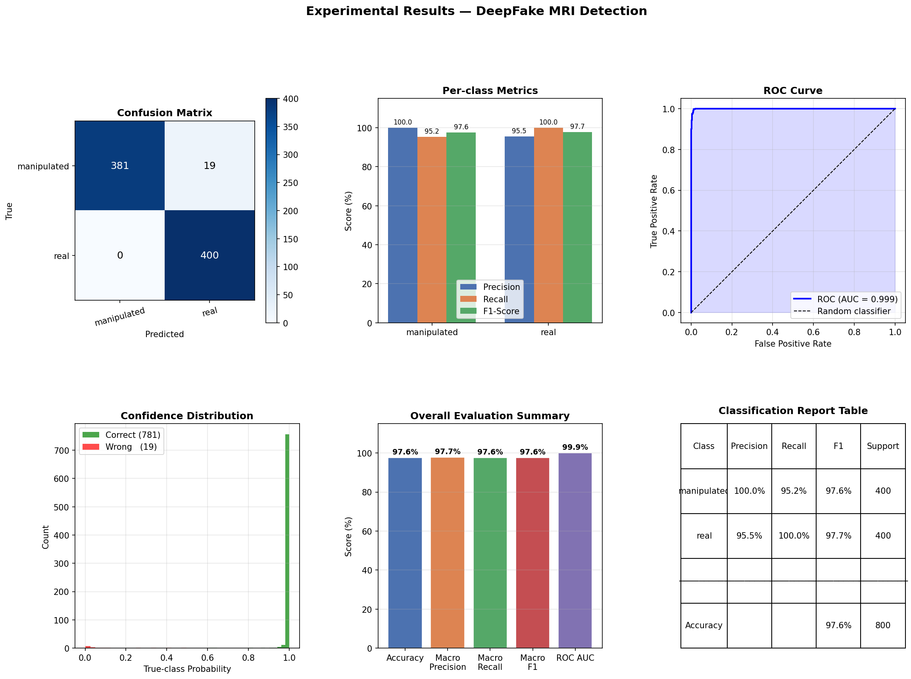

# Detection of Tumor Manipulation in MRI Scans

This repository provides a complete solution for detecting tampering and manipulation of brain tumor MRI scans using deep learning. It offers end-to-end workflows from data loading and augmentation to model training, forensic analysis, visualization, and result interpretation.

## Table of Contents
- [Overview](#overview)
- [Features](#features)
- [Repository Structure](#repository-structure)
- [Getting Started](#getting-started)
    - [Requirements](#requirements)
    - [Installation](#installation)
- [Usage](#usage)
- [Visualizations & Results](#visualizations--results)
- [Contributing](#contributing)
- [License](#license)
- [Disclaimer](#disclaimer)

## Overview

Image integrity in medical diagnostics is critical. This project focuses on automating the detection of tumor manipulation and synthetic tampering in brain MRI scans using state-of-the-art neural networks and forensic AI explainability tools.

It covers:
- Data handling for MRI images
- Generation/Simulation of tampered data
- Deep forensics modeling, training, and evaluation
- Visualization of results (including GradCAM)
- Reproducible experiments via Jupyter Notebooks

## Features

- **Deep Learning for Image Forensics:** Leverages CNNs (PyTorch) for classifying real vs. manipulated MRI scans.
- **Visualization:** GradCAM for visual explanation of model decisions.
- **Data Simulation:** Tools to create and experiment with tampered MRI data.
- **Jupyter Notebooks:** Step-by-step workflows for experimentation and result analysis.
- **Pre-trained Model:** Quickly test or extend using provided model weights.

## Repository Structure

```
.
├── deepfake_mri_detection.ipynb        # Main analysis and workflow notebook
├── deepfake_mri_detection2.ipynb       # Additional experiments/analysis
├── pyt.py                             # CUDA/PyTorch setup check
├── requirements.txt                   # Python dependencies
├── confusion_matrix.png               # Sample result visualization
├── experimental_results.png           # Experimental results image
├── src/
│   ├── __init__.py                    # Package init
│   ├── data_loader.py                 # Dataset loading/handling
│   ├── forensic_model.pth             # Pretrained model weights
│   ├── generate_data.py               # Data simulation/augmentation
│   ├── gradcam.py                     # GradCAM visualization utility
│   ├── model.py                       # Model definitions
│   ├── tampering.py                   # Tampering/detection utilities
│   ├── train.py                       # Training/evaluation script
└── ...
```

## Getting Started

### Requirements

- Python 3.7+
- See `requirements.txt` for dependencies:
    - torch, torchvision, torchaudio
    - opencv-python, numpy, pillow
    - matplotlib, scikit-learn

### Installation

1. **Clone the repository:**
   ```bash
   git clone https://github.com/Tayanithaa/Detection-of-Tumor-Manipulation-in-MRI-Scans.git
   cd Detection-of-Tumor-Manipulation-in-MRI-Scans
   ```

2. **Install dependencies:**
   ```bash
   pip install -r requirements.txt
   ```

3. **(Optional) Check your PyTorch/CUDA setup:**
   ```bash
   python pyt.py
   ```

4. **Launch Jupyter Notebook:**
   ```bash
   jupyter notebook
   ```
   Open `deepfake_mri_detection.ipynb` or `deepfake_mri_detection2.ipynb` to start.

## Usage

- Follow the Jupyter Notebooks for full workflows: data loading, simulation, model training, evaluation, and visualization.
- Explore the `src/` directory for Python scripts defining data utilities, models, tampering techniques, GradCAM visualization, and training loops.
- Use the provided pre-trained model (`forensic_model.pth`) or train your own using `train.py`.

## Visualizations & Results

Sample visual outputs:
- 
- 

These images showcase the performance and interpretability of the detection approach.

## Contributing

Contributions and suggestions are welcome. To contribute:
1. Fork this repository
2. Create a feature branch (`git checkout -b feature/my-feature`)
3. Commit your changes
4. Push your branch
5. Open a Pull Request

## License

This project is licensed under the MIT License. See [LICENSE](LICENSE) for details.

## Disclaimer

This project is intended for research and educational purposes. Further validation is needed for clinical deployment. Do not use this software for direct medical decision-making.

---

**Author:** [Tayanithaa](https://github.com/Tayanithaa)
